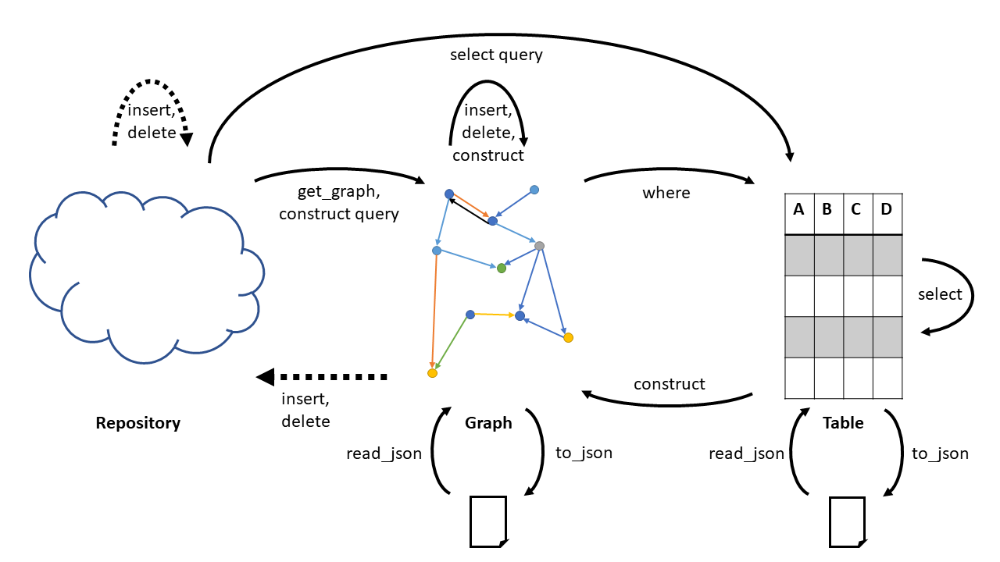

# Grizzly

Grizzly is a [Pandas](http://pandas.pydata.org/) based package working with RDF graphs.

## Contents

- [Release notes](#release-notes)
- [Installation](#installation)
    - [Direct installation to simply use Grizzly](#direct-installation-to-simply-use-grizzly)
    - [Install Grizzly for development](#install-grizzly-for-development)
- [General use](#general-use)
- [Tutorials](#tutorials)
- [module *grizzly*](#module-grizzly)
    - [class **Base**](#class-base)
    - [class **Graph**](#class-graph)
    - [class **Table**](#class-table)
    - [class **Repository**](#class-repository)


## Release notes

Please check the [release notes](CHANGELOG.md) for detailed changes by version.

## Installation

Grizzly is a ready to install Python package. You need to have Python 3 installed (not tested with Python 2) and the packages listed in the requirements file.

```sh
pip install -r requirements.txt
```

### Direct installation to simply use Grizzly

You can install Grizzly directly from this repository. On the command line type

```sh
pip install git+https://github.com/elsevierlabs-os/grizzly.git
```

To upgrade Grizzly to a new version run:

```sh
pip install --upgrade grizzly
```

### Install Grizzly for development

Clone the repository to a convenient location for you.

```sh
git clone https://github.com/elsevierlabs-os/grizzly.git
```

Then install Grizzly without transferring it to the Python site-packages directory. This way any change to the source files is immediately reflected when you use the package.

```sh
cd grizzly
pip install -e .
```

## General use



Load triples from a CSV file:

```python
import grizzly as gz
graph = gz.read_csv('filename.csv')
```

Load a graph from a remote graph store (replace the text between asterisks):

```python
creds = {'base_url': 'http://localhost:8000',
         'name': 'example',
         'username': **username**,
         'password': **password**}
store = gz.Repository(**creds)
graph = store.query('select * {?s ?p ?o .} limit 100')
```


Run a SPAQRL query:

```python
graph.query('''
select ?sub
where {
  ?sub ?pre ?obj .
}
''')
```

Run a query using the GraphFrames DSL:

```python
graph.find('(a)-[b]->(c);(c)-[d]->(e)').filter('b = skos:broader')
```

You can run update queries directly. This returns a new graph with the updates:

```python
updated_graph = graph.query('''
delete {
  ?parent skos:narrower ?child.
}
insert {
  ?parent skos:broader ?child .
}
where {
  ?parent skos:narrower ?child.
}
''')
```

It is also possible to delete or insert triples that had previously been generated through a CONSTRUCT query:

```python
new_triples = graph.query('''
construct {
  ?parent skos:broader ?child .
}
where {
  ?parent skos:narrower ?child.
}
''')
updated_graph = graph.insert(new_triples)
```

Serialize the graph to plain triples that can be uploaded to a graphstore:
```python
triples = graph.to_triples()
```


## Tutorials


- [Get started](examples/grizzly-demo.ipynb)

## module *grizzly*:

- **read_turtle** *(string, custom_prefixes={})*:

     Reads a file or string in ttl format and returns a `Graph`. You can supply `custom_prefixes` that should be taken into account. 

- **read_csv** *(string, *args, custom_prefixes={}, keep_default_na=False, **kwargs)*:

     Reads a file or string in CSV format and returns a `Graph`. You can supply `custom_prefixes` that should be taken into account. 

- **read_json** *(string, custom_prefixes={})*:

     Reads a file or graph store response in the JSON format. If it is RDF/JSON it returns a typed Graph, if it has the MIME type 'application/sparql-results+json' it return a typed DataFrame. You can supply `custom_prefixes` that should be taken into account. 

- **read_ntriples** *(string, custom_prefixes={})*:

     Reads a file or string of N-triples and returns a `Graph`. This might be slow as it uses the query parser at the moment.You can supply `custom_prefixes` that should be taken into account. 

- **read_remote** *(query, endpointURL, repository, custom_prefixes={}, username='', password='')*:

     Queries a SPARQL endpoint at `endpointURL` with `query`. The preferred way at the moment is to instead call a query on a `Repository` instance. 

### class **Base**:

- **parse** *(query, rule_name='query', parser='SPARQL')*:

     Parses a string `query` with the parser indicated in `parser`. By default assumes to start with the start rule `query` but other rules can be as argument to `rule_name`. 

- **term** *(query, *args, ast=False, **kwargs)*:

     *No description yet*

- **variable** *(query, *args, ast=False, **kwargs)*:

     *No description yet*

- **resource** *(query, *args, ast=False, **kwargs)*:

     *No description yet*

- **literal** *(query, *args, ast=False, **kwargs)*:

     *No description yet*

- **expression** *(query, *args, ast=False, **kwargs)*:

     *No description yet*

- **call** *(query, *args, ast=False, **kwargs)*:

     *No description yet*

- **constrain** *(constraints, parts)*:

     *No description yet*

- **filter** *(expression)*:

     Filter values according to expression following the GraphFrames pattern. 

- **copy_metadata** *(source)*:

     *No description yet*

- **decode** *(value=None)*:

     *No description yet*

- **encode** *(value=None)*:

     *No description yet*

- **encode_value** *(value)*:

     *No description yet*

- **to_pandas** *()*:

     *No description yet*

- **to_koalas** *()*:

     *No description yet*

- **to_csv** *(*args, index=False, decode=True, **kwargs)*:

     *No description yet*

### class **Graph**:

This class represents an RDF graph in memory. 

- **find** *(query_string)*:

     Query the graph with the motif patterns used in GraphFrame, like e.g. `graph.find('(sub)-[pre]->(obj)')`. Not fully implemented at the moment. 

- **query** *(query_string)*:

     Query the graph with a SPARQL query. Currently supported are `CONSTRUCT`, `SELECT`, `DELETE` and `INSERT` queries. Returns a `Graph` instance or a `Table` instance depending on the type of the query. 

- **where** *(query, *args, ast=False, **kwargs)*:

     *No description yet*

- **triple** *(query, *args, ast=False, **kwargs)*:

     *No description yet*

- **delete** *(triples, name='')*:

     Deletes `triples` from the graph. `triples` must be a `DataFrame` or of a subclassed class with three columns. 

- **insert** *(triples, name='')*:

     Adds `triples` to the graph. `triples` must be a `DataFrame` or of a subclassed class with three columns. 

- **get_graph** *(name='')*:

     *No description yet*

- **get_encoded_triples** *(triples)*:

     *No description yet*

- **to_table** *()*:

     *No description yet*

- **to_triples** *()*:

     *No description yet*

- **to_turtle** *(filename)*:

     *No description yet*

- **to_json** *(filename=None)*:

     Serializes the graph to RDF/JSON. Returns a string if no `filename` is given, otherwise save the result as file. 

- **to_property_graph** *(filename=None, property_names={}, directed=False, multigraph=False, graph={})*:

     *No description yet*

- **to_remote** *(endpointURL, repository, graph, username=None, password=None)*:

     *No description yet*

### class **Table**:

- **select** *(query, *args, ast=False, **kwargs)*:

     *No description yet*

- **construct** *(query, *args, ast=False, **kwargs)*:

     *No description yet*

- **modify_solution** *(query)*:

     *No description yet*

- **groupby** *(*args, **kwargs)*:

     *No description yet*

- **sort_columns** *(col_a, col_b)*:

     *No description yet*

- **to_graph** *()*:

     *No description yet*

### class **Repository**:

This class represents a graph store repository as an abstraction over a REST API. The API is designed to mirror the API of the local `Graph` class. All methods take instances of `Graph` as arguments and return instances of `Graph` or `Table`. Initialize with the `base_url` (e.g. `http://localhost:7200`). In the case of an RDF4J endpoint either select the repository by providing it as `repository_name` or included it in the `base_url` (e.g. `http://localhost:7200/repositories/example`). Additionally `custom_prefixes` can be supplied which will be used to generate prefix defintions in queries. For authentication you can provide `username` and `password`. 

- **query** *(query)*:

     Query the repository with a SPARQL query. Automatically adds known prefix defintions to the query. Currently supported are `CONSTRUCT`, `SELECT`, `DELETE` and `INSERT` queries. Returns a `Graph` instance or a `Table` instance depending on the type of the query. 

- **insert** *(graph, name)*:

     Inserts `graph` into the repository. `graph` should be a `Graph` instance. The graph will be inserted into `name` which can either be a named graph or `'default'`. Returns `True` if succesful. 

- **get_graph** *(name)*:

     Gets an entire graph from the repository and returns it as `Graph` instance. The graph `name` can either be a named graph or `'default'`. 

- **list_graphs** *()*:

     Returns a `Table` containing all named graphs in the repository. 

- **size** *()*:

     Returns the number of triples in the repository. 

